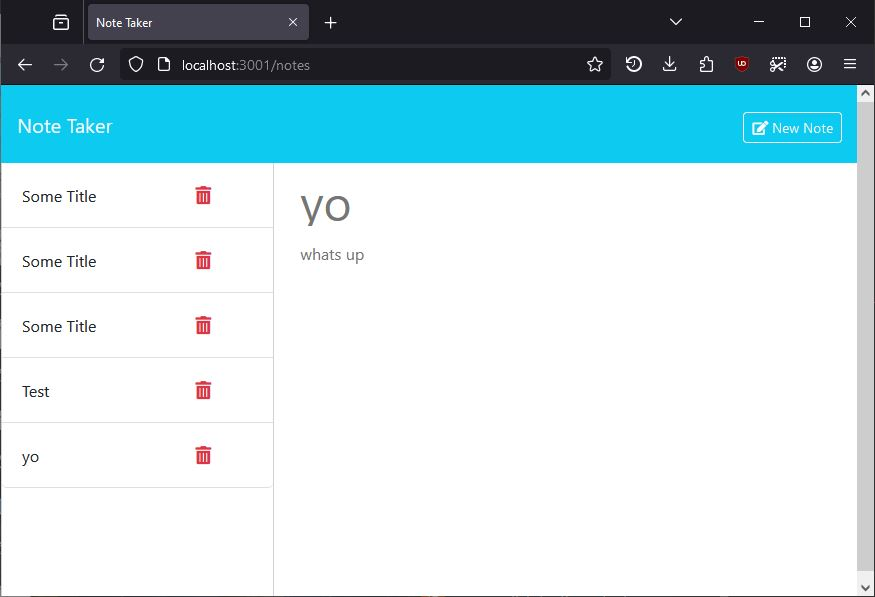

# Note Taker Starter Code

# Description
Application built to allow user to view, record, and delete notes.

# Installation
Run the following command in your command line terminal
```bash
git@github.com:CLTJared/note-taker.git
```

## Usage
In your command line, run `npm i`.
Once installed, run `node server.js` to start server.

# Screenshot


## Demo
[Heroku](https://jared-note-taker-92e37797e61c.herokuapp.com/)

# Collaborators
Initial starting code cloned from [Xandromus - Coding Boot Camp](https://github.com/coding-boot-camp/miniature-eureka)